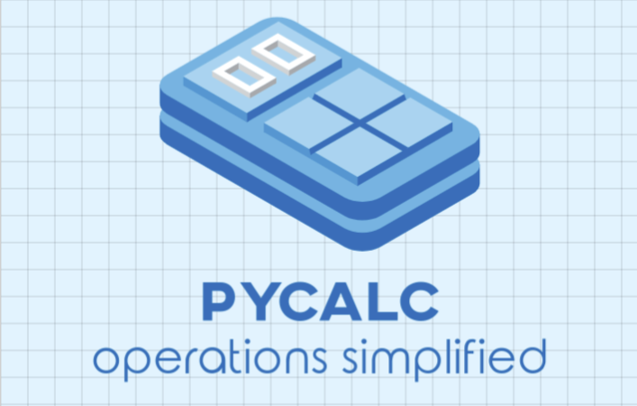

<p align="center">
  
</p>

## Documentation

Documentation for the program's user manual is available by typing `--help` at the CLI.

## Characteristics

Pycalc computes the following math expressions:

- Numerical and Algebraic expressions
- Derivatives
- Integrals

## Getting started

### Prerequisites

You need to have installed:

- Python 3
- pip
- virtualenv

### Install the project

Create a virtual environment:

```
virtualenv venv
```

Activate the envrionment:

```
.\venv\Scripts\activate
```

Install the dependencies of the project:

```
pip install -r requirements.txt
```

## Usage example

Having the virtual environment in execution:

```
python main.py --help
```

## Authors:

|Name|ID|
|-|-|
|Mikhael Santos Fernandez|1088621|
|Fernando Miguel González|1101310|

